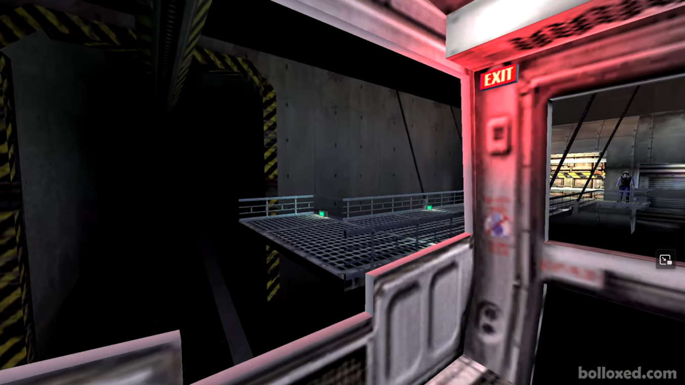
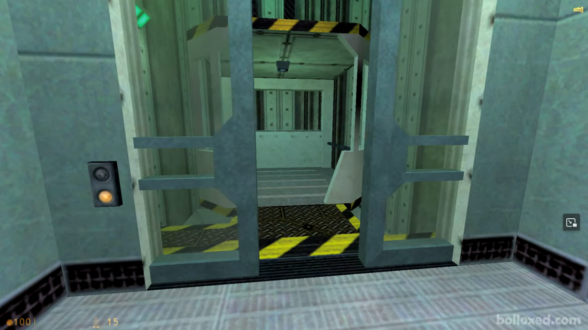
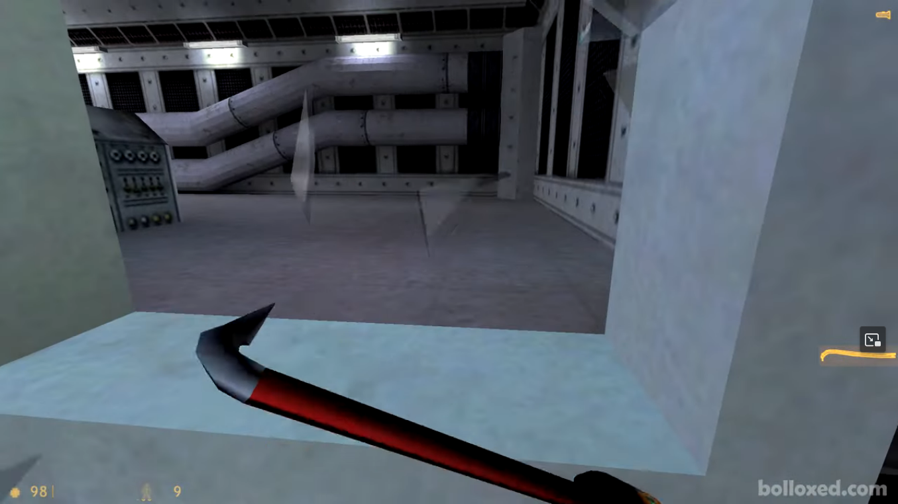

# Especificação da Implementação

## Integrantes da dupla

- **Aluno 1 - Nome**: Elias Furtado Helfer
- **Aluno 1 - Cartão UFRGS**: 00577752

- **Aluno 2 - Nome**: João Vítor Leffa Lummertz
- **Aluno 2 - Cartão UFRGS**: 00577893

## Detalhes do que será implementado

- **Título do trabalho**: Meia Vida 3
- **Parágrafo curto descrevendo o que será implementado**: Uma versão encurtada das primeiras partes do jogo  *Half-Life*, implementando alguns dos eventos e funcionalidades principais desse início.

## Especificação visual

### Vídeo - Link

https://www.youtube.com/watch?v=yTY85Per-8U

### Vídeo - Timestamp

Não conseguimos encontrar um trecho que abranja todas as features que queremos ter no nosso projeto de forma contígua. Como nossa idéia é fazer uma versão encurtada dos primeiros momentos do jogo, até os 16 minutos do vídeo anexado, escolhemos algumas funcionalidades principais que aparecem nesses 16 minutos para serem implementadas na nossa versão:

Movimentação do bondinho que carrega o jogador no início:
- **Timestamp inicial**: 4:47
- **Timestamp final**: 5:00

Interação com elevadores e portas:
- **Timestamp inicial**: 7:41
- **Timestamp final**: 7:50

Ação de pegar o crowbar e o utilizar para quebrar vidro:
- **Timestamp inicial**: 15:37
- **Timestamp final**: 15:40

### Imagens

## Especificação textual

Para cada um dos requisitos abaixo (detalhados no [Enunciado do Trabalho final - Moodle](https://moodle.ufrgs.br/mod/assign/view.php?id=6018620)), escreva um parágrafo **curto** explicando como este requisito será atendido, apontando itens específicos do vídeo/imagens que você incluiu acima que atendem estes requisitos.

### Malhas poligonais complexas
Nos vídeos, existem malhas complexas no bonde do início, nas portas, no crowbar e no mapa em si.

### Transformações geométricas controladas pelo usuário
Uso do crowbar para quebrar vidro e ação de chamar o elevador e abrir portas.

### Diferentes tipos de câmeras
No jogo, é utilizada apenas uma câmera em primeira pessoa estilo FPS. Iremos implementar também uma câmera em terceira pessoa LookAt sempre centrada no player.

### Instâncias de objetos
Portas, botões, objetos decorativos no ambiente de laboratório como cadeiras e computadores.

### Testes de intersecção
Teste de intersecção com paredes e objetos decorativos, intersecção do crowbar do jogador com vidros quebráveis.

### Modelos de Iluminação em todos os objetos
Modelo de iluminação de Phong utilizado em todos os objetos.

### Mapeamento de texturas em todos os objetos
Todos os objetos observados no vídeo possuem texturas.

### Movimentação com curva Bézier cúbica
Movimentação do bondinho que carrega o jogador no inicio do jogo.

### Animações baseadas no tempo ($\Delta t$)
Movimentação do jogador, bondinho e animação do crowbar.

## Limitações esperadas
Das features apresentadas no vídeo, não iremos implementar:
- Partículas e explosões: Fogem do escopo do trabalho e não influenciam tanto na qualidade do resultado final.

> Comentário Professor: como pensam em fazer a animação do vidro quebrando?

Se julgarmos viável dentro das nossas habilidades e do tempo para fazer o trabalho, implementaremos algumas outras funcionalidades vistas nos primeiros 16 minutos do vídeo, como:
- NPC's
- Efeitos sonoros
- Combate com inimigos

