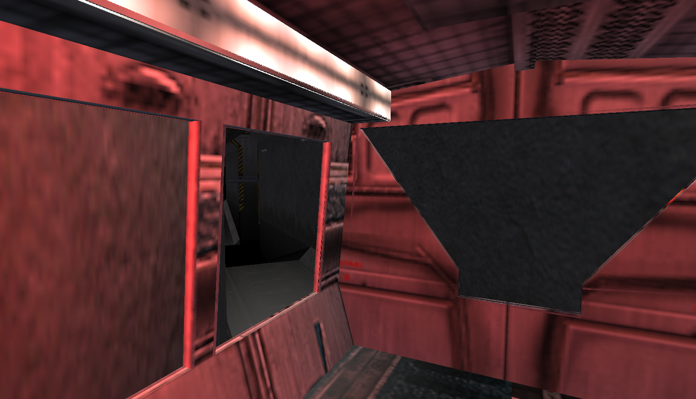
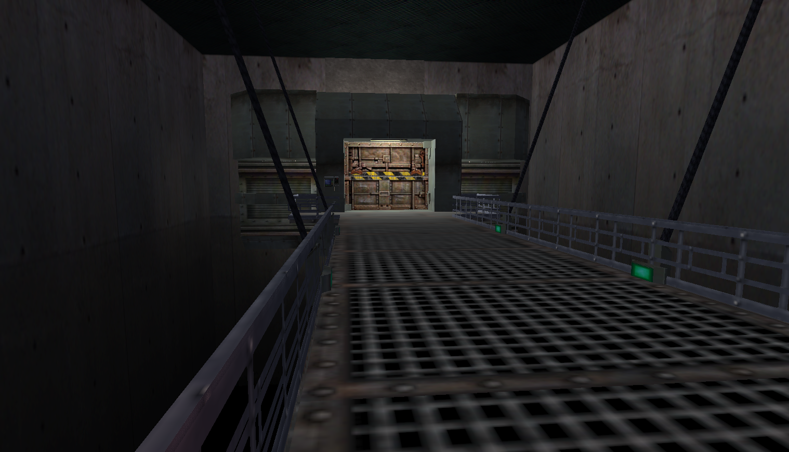
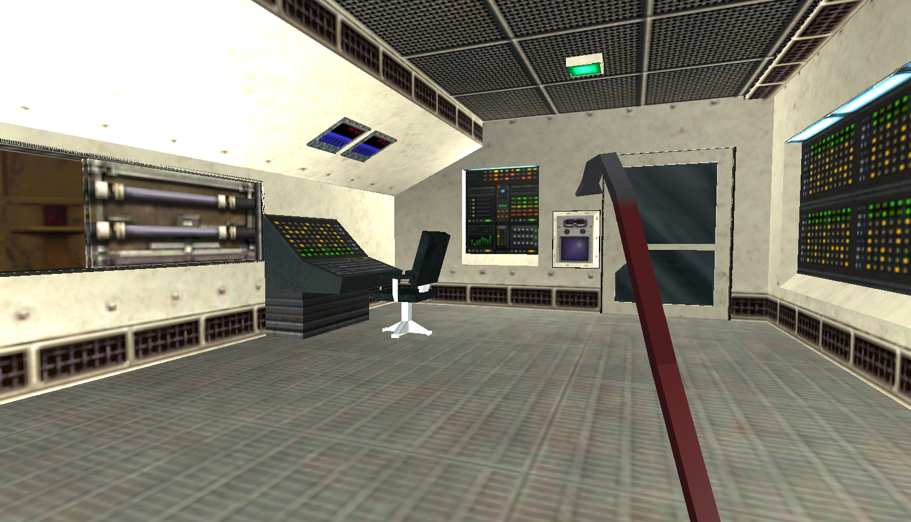

## Relatório

### Aplicação desenvolvida:
 A aplicação desenvolvida é uma versão simplificada do jogo Half-Life, lançado em 1998 pela Valve. O objetivo principal era fazer a aparência do jogo ficar o mais parecida com o jogo original quanto possível. As partes modeladas foram o movimento do bonde que leva o jogador ao laboratório e a exploração de partes do laboratório. Foi adicionado interação com portas para as abrir, pegar o crowbar do chão e equipá-lo, e um inimigo que ataca o jogador e pode ser morto pelo jogador. O jogador não pode morrer, mas é apresentado um efeito na tela de dano.

 

 

 

### Uso de IA:
 A dupla utilizou IA principalmente para tirar dúvidas sobre conceitos de Computação Gráfica e para auxiliar na implementação de features específicas do jogo, como a interação com portas e display do crowbar em 1a pessoa.

 Acreditamos que foi uma ferramenta muito boa e nos auxiliou demais. Entretanto, percebemos que a melhor forma de utilizá-la é de forma incremental e bem escopada, e que o conhecimento de computação gráfica é essencial para avaliar as soluções sugeridas pelas IAs, além de guiar a escrita dos prompts para facilitar o desenvolvimento. As IAs com frequência geram soluções over-engineered para problemas simples.

As IAs utilizadas pelo grupo foram o Claude e o Codex.

### Manual:
Movimentação: WASD
    Movimento da câmera: Mouse
    Alterar entre câmera 1a pessoa e 3a: C
    Usar o Crowbar (após o pegar): Botão esquerdo do mouse

## Como compilar e executar:
   Rode o seguinte comando no terminal:

```bash
make run
```
    